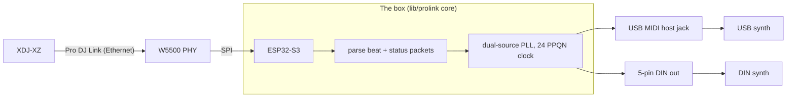

# dj-midi-sender

Standalone bridge that turns a Pioneer XDJ-XZ's Pro DJ Link Ethernet broadcast
into rock-solid MIDI clock with continuous tempo tracking. The hardware is an
**ESP32-S3 + W5500** box with both a **USB MIDI host jack** and a **5-pin DIN
output** — no laptop in the signal chain.

It runs on real hardware today: a Waveshare ESP32-S3-ETH clocks class-compliant
USB MIDI synths (plugged into the box's USB-A host jack) and a DIN synth
simultaneously, all locked to the deck's tempo and following pitch-fader moves.
The desktop binary drives the same core over a Mac's MIDI stack and remains a
useful reference and protocol-debugging tool.

Outputs:

- **USB MIDI** — the box is the USB host; class-compliant devices enumerate on
  the USB-A jack. Working.
- **5-pin DIN** out (data: IO17 -> 10 Ohm -> DIN pin 5; power: 3V3 -> 47 Ohm ->
  DIN pin 4) — UART1 fan-out alongside USB, both driven from the one clock.
  Working. See [docs/hardware.md](docs/hardware.md) for full wiring.

The XDJ-XZ has no native MIDI clock output. Pro DJ Link over Ethernet is the
only extraction path.

## How it works



Pioneer broadcasts two relevant packet types on the link: **beat packets**
(port 50001, one per beat) and **status packets** (port 50002, ~5 Hz). Beat
packets stream natively; status packets only flow once the bridge announces
itself as a virtual CDJ on port 50000. Tempo is taken from status packets (so
pitch-slider sweeps follow within ~200 ms instead of ~500 ms), and beat packets
nudge phase. A 24 PPQN clock is generated on a hardware timer (desktop:
`std::thread`; firmware: a native ESP-IDF `esp_timer` one-shot shim).

See [docs/architecture.md](docs/architecture.md) for protocol details, field
offsets, and PLL design; [docs/hardware.md](docs/hardware.md) for the board and
wiring; and [ROADMAP.md](ROADMAP.md) for status and what is next.

## Repo layout

```
dj-midi-sender/
├── CMakeLists.txt              # workspace root
├── lib/
│   └── prolink/                # core library — compiles unchanged on macOS AND ESP32-S3
│       ├── types.hpp           # shared constants
│       ├── packets.hpp/.cpp    # beat + status packet parsers
│       ├── clock.hpp/.cpp      # 24 PPQN PLL clock engine
│       └── bridge.hpp/.cpp     # orchestration, master tracking, state machine
├── desktop/                    # Phase 1 — macOS/Linux binary
│   ├── udp_posix.hpp/.cpp      # POSIX UDP socket
│   ├── midi_rtmidi.hpp/.cpp    # RtMidi MIDI output
│   ├── timer_posix.hpp/.cpp    # std::thread-based ITimer
│   ├── main.cpp                # xdj_bridge entry point
│   ├── replay.cpp              # xdj_replay — pcapng playback for offline dev
│   └── clockmon.cpp            # xdj_clockmon — MIDI-clock input analyzer (BPM/jitter)
├── firmware/                   # Phase 2/3/4 — Waveshare ESP32-S3-ETH (built; runs on hardware)
│   ├── platformio.ini          # envs: waveshare_esp32s3_eth (prod) + diag (serial debug)
│   ├── sdkconfig.defaults      # IDF config: W5500 SPI, USB host, 16 MB flash / PSRAM
│   └── src/
│       ├── udp_w5500.*         # IUdpSocket — lwIP over the onboard W5500
│       ├── timer_esp.*         # ITimer — esp_timer one-shot
│       ├── midi_host_usb.*     # IMidiOut — native USB MIDI host (esp_usb_host)
│       ├── midi_uart.*         # IMidiOut — DIN-5 out (UART1 @ 31250) + diag stub
│       ├── midi_fanout.hpp     # IMidiOut — one PLL tick → USB + DIN sinks
│       ├── ui_display.*        # SSD1306 status screen (U8g2, hardware I2C)
│       ├── ui_input.*          # EC11 encoder + nudge/tap buttons
│       └── main.cpp            # ethernet bring-up + wiring it all together
├── captures/                   # canonical pcapng captures for offline replay
└── docs/                       # architecture (protocol/PLL) + hardware (board/wiring)
```

`lib/prolink/` is pure C++17 with no platform headers beyond `<cstdint>`,
`<cstring>`, `<functional>`, and `<optional>`. All I/O is injected via
three small interfaces (`IUdpSocket`, `IMidiOut`, `ITimer`) so the same
code drives both Phase 1 and the firmware.

## Building (Phase 1, macOS)

Prerequisites:

```bash
brew install cmake rtmidi glfw          # libpcap ships with the Xcode SDK
```

(`glfw` is only needed for the `--visualize` GUI panel. To skip it,
configure with `-DXDJ_GUI=OFF` — the bridge will build headless-only.
Dear ImGui itself is pulled in by CMake's FetchContent and pinned to a
specific tag — no manual setup needed.)

Configure and build:

```bash
cmake -S . -B build -DCMAKE_BUILD_TYPE=Release
cmake --build build
```

Three binaries land in `build/desktop/`:

- `xdj_bridge` — listens on the link and sends MIDI clock
- `xdj_replay` — replays a pcapng capture to localhost (offline dev loop)
- `xdj_clockmon` — MIDI-clock **input** analyzer: point a MIDI OUT (the box's
  DIN, or any port) at a MIDI IN and it prints derived BPM, per-tick jitter,
  and Start/Stop events. Built to validate the DIN output quantitatively.
  `xdj_clockmon --list` to see input ports; `--port "<name>" [--seconds N]`.

## Running

### Offline (against a capture)

Two terminals:

```bash
# T1 — replay the pitch-sweep capture in a loop
./build/desktop/xdj_replay --file captures/xdj-xz-export-mode-pitch-sweep.pcapng --loop

# T2 — run the bridge against localhost
./build/desktop/xdj_bridge --bind 127.0.0.1 --midi-port "<your-interface>"
```

Note: the canonical captures contain beat packets only (no status packets —
no virtual CDJ was present during capture). Replay-mode runs validate the
parsers and the phase-correction path; tempo-tracking smoothness has to be
validated against a live XZ.

### Live (against the XDJ-XZ)

Plug the XZ into your Mac's Ethernet (USB-Ethernet dongle is fine). Put the
XZ in Export mode with a rekordbox-analyzed track loaded, then:

```bash
./build/desktop/xdj_bridge --midi-port "OP-XY"
```

(Use `--list-midi` to print the exact CoreMIDI port name the OP-XY
enumerates as — it usually matches the device name verbatim.)

The bridge auto-detects the interface, sends a virtual-CDJ keep-alive on
port 50000 broadcast every 1500 ms, and starts receiving status packets on
port 50002. Pressing play on the XZ should produce MIDI Start + 24 PPQN
clock immediately.

CLI flags:

```
--bind <addr>           UDP bind address (default 0.0.0.0; use 127.0.0.1 with replay)
--interface <iface>     Network interface for virtual-CDJ announce (default: auto)
--midi-port <name>      MIDI output port (default: first available)
--list-midi             List MIDI output ports and exit
--bpm <float>           Fallback BPM when no valid signal (default 120.0)
--device-num <n>        Virtual CDJ device number (default 7)
--gain <n>              PLL phase correction gain divisor (default 16)
--clock-offset-ms <f>   Lead the beat by N ms (chain latency). Persisted per port.
--grid-offset-ms <f>    Per-track beat-grid offset (session only).
--no-vcdj               Skip the virtual-CDJ announce (beat packets only)
--visualize             Open the ImGui debug panel
--verbose               Per-packet debug output
```

### The visualizer

`--visualize` opens a small GUI window (Dear ImGui via GLFW + OpenGL) with
three panels:

- **Master** — device + bar position (4 dots, downbeat red), track BPM,
  pitch %, effective BPM, status flags (master / playing / sync / on-air),
  Mv validity, packet counts.
- **MIDI clock out** — port, tick-pulse bar (one blip per emitted clock
  byte), tick rate (`ticks/sec` and derived BPM), tick-in-beat (0–23),
  phase error, current tick period.
- **Offsets** — clock and grid offsets with `±1 ms` / `±10 ms` buttons.

Keyboard:

| Key | Action |
|-----|--------|
| `←` / `→` | Grid offset ∓1 ms (per-track, session only) |
| `↑` / `↓` | Grid offset ±10 ms |
| `Shift+←` / `Shift+→` | Grid offset ∓10 ms (alternative to `↑`/`↓`) |
| `[` / `]` | Clock offset ∓1 ms (per-port, persisted) |
| `Shift+[` / `Shift+]` | Clock offset ∓10 ms |
| `0` or `R` | Reset grid offset |
| `Q` or `Esc` | Quit |

### The two-axis offset model

| Axis | What it compensates | Scope | Persistence |
|------|---------------------|-------|-------------|
| **Clock offset** | USB / slave physical processing latency | per output port | `~/.config/dj-midi-sender.json`, loaded on startup |
| **Grid offset**  | Per-track rekordbox beat-grid skew | per session | never persisted |

The scheduler sees only the sum. Splitting them means the OP-XY's clock
calibration stays correct across tracks while you twiddle grid-offset
between songs whose intros are wonky.

## Firmware (ESP32-S3)

The box is a **Waveshare ESP32-S3-ETH** (integrated W5500). `lib/prolink/`
compiles unchanged — only the I/O layer differs (`firmware/src/`). Built with
PlatformIO; the same core that runs the desktop binary drives the hardware.

```bash
cd firmware

# production — USB MIDI host mode (this is the box)
pio run -e waveshare_esp32s3_eth -t upload --upload-port /dev/cu.usbmodemXXXX

# diag — counter-stub MIDI, keeps the USB-C serial console alive for debugging
pio run -e diag -t upload --upload-port /dev/cu.usbmodemXXXX
pio device monitor -e diag
```

Gotchas (full list in [docs/hardware.md](docs/hardware.md)):

- **No serial in host mode.** USB-Serial-JTAG and USB-OTG share one PHY, so the
  production build's console is dead — status shows on the OLED and the RGB LED
  (blue = waiting, red = device without a MIDI interface, green = clocking).
  Use the `diag` build when you need serial.
- **To flash**, force the ROM bootloader: hold BOOT, tap RESET, release BOOT.
- **Power rule:** with a synth in the USB-A jack, power from a charger/wall, not
  a computer — two hosts on the shared IO19/20 lines conflict.

Board pinout, wiring, the USB-host enumeration fix, and the DIN pin-4/5 wiring
trap are in [docs/hardware.md](docs/hardware.md).

### Front-panel controls

128×64 OLED, an EC11 encoder (rotate + push), three buttons (nudge −, nudge +,
tap). The UI is a small mode machine — **Normal** status screen, **Source-select**,
and a **Settings menu**.

**Normal screen**
- **Nudge - / +** — trim the clock offset by the configured *Offset step*;
  **hold** to auto-repeat with acceleration. Offset persists to NVS (+30 ms
  first-boot fallback).
- **Tap** (in Sync/Free) — **beat re-sync**: re-emits MIDI Start so a slave
  whose transport was stopped/started locally snaps back to bar alignment. In
  Sync it lands on the master's next downbeat; in Free it restarts immediately.
  OLED flashes `RSYN`.
- **Encoder push** -> Source-select. **Hold both nudges ~1 s** -> Settings menu.

**Source-select** (`auto / P1-P4 / mstr / off`) — **spin** moves a `>` cursor
(the active source stays put), **push** confirms, **tap** cancels. It answers
"what drives the clock":

| Source | Meaning |
|---|---|
| `auto` | follow whichever deck holds the DJ-Link master role |
| `P1`-`P4` | pin to that deck |
| `mstr` | **the box is the tempo master** — it claims the role and the decks follow it |
| `off` | standalone manual tempo, link ignored |

**Tempo master (`mstr`)** — the box performs the Pro DJ Link master handoff:
it asks the current master to yield, and only claims the role once that deck
acknowledges (OLED shows `REQ` during the handshake, `MSTR` once it holds it).
It takes over **at the tempo it was already following**, so grabbing master
mid-set doesn't lurch the music; **spin** to nudge from there.

A DJ can always take it back: press MASTER on a deck and the box acknowledges,
steps down, and returns to `auto`. Selecting a different source also releases
it — the box appoints a deck as master on the way out, so the link is never
left without one.

**Standalone (`off`)** — no DJ-Link needed. The clock cold-starts on a manual
tempo (OLED shows `OFF`). **Tap in rhythm** = tap-tempo (averages the last 8
taps); **spin** = fine-tune by the *Tap-fine* step (default 0.1 BPM).

**Free mode** (player source) — keeps clocking when the deck stops; **hold tap +
spin** trims BPM live (`MAN`). A master beat re-syncs.

**Settings menu** — spin to scroll, push to edit, spin to change, push to save,
tap to back. All persisted to NVS: **Mode** (Sync/Free), **BPM step**
(0.1/0.5/1/5), **Tap fine** (0.1/0.25/0.5/1), **Offset step** (0.1/0.5/1 ms).

The **encoder direction** is inverted from the raw quadrature to match the
panel feel ([ui_input.cpp](firmware/src/ui_input.cpp)).

## Captures

Two pcapng files in [captures/](captures/) verified against real XZ hardware:

| File | Contents | Use for |
|------|----------|---------|
| `xdj-xz-export-mode.pcapng` | 297 beat packets, steady 132 BPM, ~134 s | baseline lock verification |
| `xdj-xz-export-mode-pitch-sweep.pcapng` | 144 beat packets, 136 BPM track, pitch swept ±6%/±10%/±16%/WIDE (−70% to +100%) | pitch encoding + tempo tracking |

Neither contains port 50002 status packets — no virtual CDJ was present
when the captures were taken. To exercise the dual-source path end-to-end,
you need the live XZ.

## Constraints worth knowing

- **Export mode only.** The XZ drops Pro DJ Link entirely in Performance mode.
- **Rekordbox-analyzed tracks only for valid BPM.** Unanalyzed audio sets
  `Mv != 0x8000`; freeze the last known good tempo in that case.
- **Use `Pitch1` (status `0x8C`), never `Pitch2` (`0x98`).** When a CDJ
  is synced to a master, `Pitch1` tracks the master and `Pitch2` stays
  pinned to the local fader — they diverge. (The original handoff's `0x28`/
  `0x30` were wrong; corrected offsets are in [docs/architecture.md](docs/architecture.md).)
- **Virtual CDJ uses device number 7.** CDJ deck numbers 1–4 are reserved
  for real decks; 5–6 are reserved for mixers. 7 is safe.

## Status

The full pipeline runs on real hardware (Waveshare ESP32-S3-ETH): Ethernet in,
parse, dual-source PLL, 24 PPQN clock, out over both the USB MIDI host jack and
the 5-pin DIN simultaneously, locked to the master's tempo and pitch. The
front-panel UI (OLED, encoder, buttons) drives source-select, a persisted
settings menu, offset trim, free-run, standalone tap-tempo, and manual beat
re-sync. The desktop binary is a validated reference implementation.

A drift-free timer plus continuous-microsecond phase lock keep slaves tight
across tempo changes, and bar-slip realignment is gated behind a confidence
counter so a dropped beat packet cannot cause a false stop.

See [ROADMAP.md](ROADMAP.md) for the full status and what is next (the large
item: ESP32 as Pro DJ Link tempo master, so CDJs sync to the box).

## Contributing

See [CONTRIBUTING.md](CONTRIBUTING.md).

## License

Copyright 2026 Calvin Zikakis. Licensed under the
[PolyForm Noncommercial License 1.0.0](LICENSE) — free to use, modify, and
build on for any **noncommercial** purpose (personal, hobby, research,
education, nonprofits). Commercial use requires a separate license from the
author. This is a source-available license, not an OSI-approved open-source
one.
