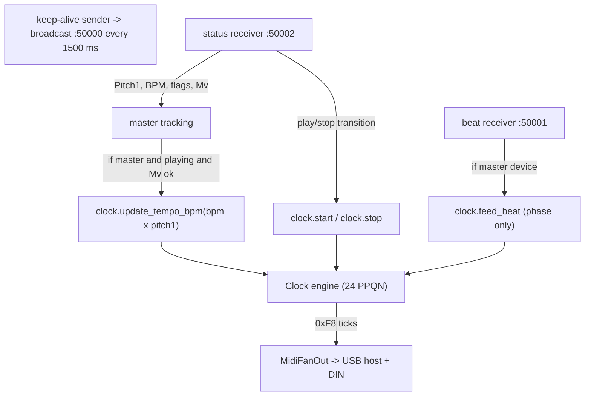

# Architecture

> **Status and hardware:** see [../ROADMAP.md](../ROADMAP.md) for what is built
> and [hardware.md](hardware.md) for the board and wiring. This doc is the
> protocol/PLL reference and stays accurate; it does not track day-to-day state.

This document captures the Pro DJ Link wire format, the dual-source clock
design, and the C++ module boundaries. Everything below is verified
empirically against the captures in [../captures/](../captures/) — not
just lifted from upstream documentation. Where a field is documented from
upstream sources but not present in our captures (status packets), the
source is named inline.

## Pro DJ Link on the XDJ-XZ

The XZ broadcasts Pro DJ Link traffic on the link-local network as soon as
a track is playing on the master deck in **Export mode**. No virtual CDJ
announce is required to *receive* beat packets — the XZ transmits
unsolicited. Status packets (port 50002) are different: they are sent
**unicast** to whoever announced themselves as a CDJ on port 50000.

| Port  | Direction      | Type                          | Cadence         | Triggered by |
|-------|----------------|-------------------------------|-----------------|--------------|
| 50000 | XZ → broadcast | `0x06` keep-alive announce    | ~500 ms         | always       |
| 50001 | XZ → broadcast | `0x28` beat packets           | one per beat    | always       |
| 50002 | XZ → unicast   | `0x0A` status packets         | ~200 ms         | only after we announce a virtual CDJ |

Source addressing observed: an RFC 3927 link-local IP (`169.254.0.0/16`) and
the mixer's hardware MAC; destination `169.254.255.255` for broadcast traffic.

### Mode requirements

- **Export mode** (XZ playing from USB stick): Pro DJ Link active. **Required.**
- **Performance mode** (USB to rekordbox on laptop): XZ drops off Pro DJ Link
  entirely. Not viable for this project.
- **Unanalyzed audio** (raw MP3 with no rekordbox beat grid): the `Mv` field
  in status packets is not `0x8000`, so the BPM is not trusted. The front
  panel's tap-tempo and standalone sources cover this case.

## Beat packet — port 50001, type `0x28`

All offsets are relative to the start of the UDP payload. Parsed by
`parse_beat_packet()` in [`../lib/prolink/packets.cpp`](../lib/prolink/packets.cpp).

| Offset | Size | Field | Notes |
|--------|------|-------|-------|
| `0x00` | 10 B | Magic header | ASCII `Qspt1WmJOL` |
| `0x0A` | 1 B  | Packet type | `0x28` for beat |
| `0x0B` | 20 B | Device name | ASCII, null-padded (e.g. `XDJ-XZ`) |
| `0x1F` | 1 B  | Device subtype | `0x01` |
| `0x21` | 1 B  | Device number | 1–4, matches deck |
| `0x22` | 2 B  | Payload length | uint16 BE |
| `0x24` | 4 B  | ms until next beat | uint32 BE |
| `0x28` | 4 B  | ms until 2nd beat | uint32 BE |
| `0x2C` | 4 B  | ms until next bar (downbeat) | uint32 BE |
| `0x30` | 4 B  | ms until 4th beat | uint32 BE |
| `0x34` | 4 B  | ms until 2nd bar | uint32 BE |
| `0x38` | 4 B  | ms until 8th beat | uint32 BE |
| `0x3C` | 24 B | reserved (zeros / `0xFF` pad) | |
| `0x54` | 4 B  | Pitch (raw) | uint32 BE, see below |
| `0x58` | 2 B  | reserved | typically `0x0000` |
| `0x5A` | 2 B  | Track BPM × 100 | uint16 BE |
| `0x5C` | 1 B  | Beat-within-bar | 1–4 |
| `0x5F` | 1 B  | Device number (echo) | `0x5D`–`0x5E` are zero |

### Beat packet timing characteristics

Measured from `xdj-xz-export-mode.pcapng`:

- Track BPM 132 → expected inter-beat interval 454.5 ms.
- Observed range: **452.6–455.9 ms**, jitter ≈ ±2 ms.
- Occasional missed/coalesced packets (one ~934 ms gap = two intervals
  fused). The clock engine must free-run through gaps.

## Status packet — port 50002, type `0x0A`

**Not present in our captures.** Status packets are sent unicast only after
a device announces itself on port 50000. The field offsets below come from
[deep-symmetry's DJ Link analysis](https://djl-analysis.deepsymmetry.org/djl-analysis/)
and the
[`flesniak/python-prodj-link`](https://github.com/flesniak/python-prodj-link)
+ [`grantHarris/prolink-cpp`](https://github.com/grantHarris/prolink-cpp)
implementations.

| Offset | Size | Field | Notes |
|--------|------|-------|-------|
| `0x00` | 10 B | Magic header | same as beat packet |
| `0x0A` | 1 B  | Packet type | `0x0A` for status |
| `0x0B` | 20 B | Device name | null-padded ASCII |
| `0x21` | 1 B  | Device number | |
| `0x88` | 2 B  | `state` (uint16 BE; `0x84` always set + flags) | flag bits live in the low byte at `0x89` |
| `0x89` | 1 B  | Flags (low byte of state) | bit 6 = Playing, bit 5 = Master, bit 4 = Sync, bit 3 = On-Air |
| `0x8C` | 4 B  | **`Pitch1`** (effective pitch) | uint32 BE — what the player communicates as its actual playing tempo. **Use this.** |
| `0x90` | 2 B  | `Mv` validity / BpmState | uint16 BE; `0x8000` = rekordbox, `0x7FFF` = unanalyzed |
| `0x92` | 2 B  | Track BPM × 100 | uint16 BE |
| `0x98` | 4 B  | `Pitch2` (local fader only) | uint32 BE — diverges from Pitch1 in sync mode. **Ignore.** |
| `0x9E` | 1 B  | **`Mm`** master flag | `0x01` when this device is the tempo master, else `0x00` |
| `0x9F` | 1 B  | **`Mh`** master handoff | device number this player is yielding master to, or `0xFF` for none |
| `0xA6` | 1 B  | Beat-within-bar | 1–4 |

Full packet size observed live: **284 bytes** (XDJ-700) / **292 bytes** (XDJ-XZ
decks) — varies by player model.

### Master designation — verified against live hardware (XDJ-700 + XDJ-XZ)

Captured on a live link with an XDJ-700 acting as tempo master alongside an
XDJ-XZ. Diffing the master's status packet against the followers', the master
role is exactly two fields:

- **`0x89` bit 5 set** (flags `0xEC` on the master vs `0xCC` on followers), and
- **`0x9E` = `0x01`** (`Mm`, "I am master"); everyone else has `0x00`.

`0x9F` (`Mh`) is `0xFF` on all when no handoff is in progress; a yielding
master puts the incoming device's number there. Asserting those fields is not
enough on its own — an existing master must first be asked to yield. That
handshake is implemented and verified live; see
[Becoming the tempo master](#becoming-the-tempo-master-working).

Sources cross-checked: [Deep Symmetry beat-link `CdjStatus.java`](https://github.com/Deep-Symmetry/beat-link/blob/master/src/main/java/org/deepsymmetry/beatlink/CdjStatus.java),
[python-prodj-link `packets.py`](https://github.com/flesniak/python-prodj-link/blob/master/prodj/network/packets.py)
(`StatusPacket` struct, fields `physical_pitch` / `actual_pitch` / `bpm_state` / `bpm` / `state` / `beat`),
[Deep Symmetry DJL Analysis](https://djl-analysis.deepsymmetry.org/djl-analysis/vcdj.html).
Earlier revisions of this doc carried offsets from an unverified source that
were ~104 bytes off — fixed once Phase 1 saw live status packets and the
discrepancy showed up in the GUI.

### Pitch1 vs Pitch2 — the critical distinction

When a CDJ is in **sync mode** following a master, `Pitch1` tracks the
master's effective tempo and `Pitch2` stays pinned to wherever the local
operator left the pitch fader. They diverge. Reading the wrong one means
the bridge follows the slider on the *follower* CDJ instead of the master.

Always read `Pitch1` at `0x8C`. `Pitch2` at `0x98` exists in our parser only
so the field is documented; it is never consumed.

### `Mv` validity

| Value     | Meaning |
|-----------|---------|
| `0x8000`  | Rekordbox-analyzed track loaded → BPM valid |
| `0x7FFF`  | No track loaded |
| `0x0000`  | Non-rekordbox / unanalyzed source → BPM invalid, freeze last good tempo |

Only trust the BPM and apply tempo updates when `Mv == 0x8000`.

## Pitch encoding (the gotcha)

The 32-bit pitch field — same encoding in both beat and status packets —
encodes a *multiplier*, not a percentage. `0x00100000` (= 1 048 576)
represents 1.0×. To decode:

```cpp
float multiplier  = static_cast<float>(raw) / static_cast<float>(0x00100000u);
float pitch_pct   = (multiplier - 1.0f) * 100.0f;
float effective   = (bpm_x100 / 100.0f) * multiplier;
```

Verified reference points across the XZ's pitch range modes:

| Raw          | Multiplier | %       | Notes |
|--------------|------------|---------|-------|
| `0x00100000` | 1.000      | 0 %     | resting |
| `0x0010F5C2` | 1.060      | +6.00 % | top of standard ±6 % |
| `0x000F0A3D` | 0.940      | −6.00 % | bottom of standard ±6 % |
| `0x00128F5C` | 1.160      | +16.0 % | ±16 % range max |
| `0x00200000` | 2.000      | +100 %  | max WIDE up |
| `0x0004CCCC` | 0.300      | −70 %   | observed minimum |

Range observed in the pitch-sweep capture: **−70 % to +100 %**. Decoders
must accept the full `uint32` range — the `int8 percent` field encodings
used by some Pioneer protocol docs do **not** apply here.

The `BPM × 100` field at offset `0x5A` is the track's **native** BPM and
never changes with pitch. Effective playing BPM must always be computed:

```
effective_bpm = track_bpm × pitch_multiplier
```

In `xdj-xz-export-mode-pitch-sweep.pcapng`, the BPM field stayed at 136.00
across all 144 packets; inter-packet arrival times matched
`60_000 / (136 × multiplier)` ms.

## Virtual CDJ announcement

To unlock status packets, the bridge must announce itself as a virtual CDJ
by broadcasting type-`0x06` keep-alive packets to UDP port 50000 every
~1500 ms. The XZ then begins unicasting status packets to the bridge's IP
on port 50002.

Keep-alive packet (54 bytes total — mirror the XZ's own keep-alive from the
capture, substituting the bridge's MAC and IP):

| Offset | Size | Field |
|--------|------|-------|
| `0x00` | 10 B | Magic header |
| `0x0A` | 1 B  | Type: `0x06` |
| `0x0B` | 1 B  | Padding (zero) |
| `0x0C` | 20 B | Device name (null-padded ASCII, e.g. `xdj-bridge`) |
| `0x20` | 1 B  | Constant `0x01` |
| `0x21` | 1 B  | Device type: `0x02` (CDJ) |
| `0x23` | 1 B  | Packet length: `0x36` (single byte, not a uint16) |
| `0x24` | 1 B  | Device number |
| `0x25` | 1 B  | Constant `0x01` |
| `0x26` | 6 B  | MAC address |
| `0x2C` | 4 B  | IP address (big-endian) |
| `0x30` | 1 B  | Device count: `0x02` (CDJ-3000 compat) |
| `0x34` | 1 B  | Flags: `0x01` (is player or mixer) |
| `0x35` | 1 B  | Constant `0x64` (CDJ-3000 compat) |

Built by `build_keepalive_packet()`; the layout above is what that function
writes, and the unit tests assert it.

### Claiming a device number first

A real player does not simply start sending keep-alives on a number — it
negotiates ownership. Skipping that and squatting on a number is what upsets
other gear (an XDJ-XZ stops allowing its own deck-to-deck master handoff), so
the bridge performs the documented sequence before any keep-alive goes out,
all broadcast to port 50000 at ~300 ms:

| Stage | Type | Bytes | Carries |
|-------|------|-------|---------|
| hello | `0x0A` | 38 | device name |
| claim 1 | `0x00` | 44 | name, MAC, packet counter |
| claim 2 | `0x02` | 50 | name, IP, MAC, **the number being claimed**, counter, auto-assign flag |
| claim 3 | `0x04` | 38 | name, number, counter |

Note these packets put the device name at **`0x0C`** (20 bytes), not `0x0B` as
the beat and status packets do. Each stage is sent three times at startup; a
mid-session switch (taking or releasing the master role) sends one of each at
150 ms so the change is not audible as a multi-second stall. `Bridge` steps the
sequence from its run loop and holds keep-alives until it completes.

Layouts follow beat-link's `VirtualCdj` claim templates; the unit tests assert
them byte for byte.

Reference implementations: `Session::SendAnnounce()` in
[`grantHarris/prolink-cpp`](https://github.com/grantHarris/prolink-cpp);
`vcdj.py` in [`flesniak/python-prodj-link`](https://github.com/flesniak/python-prodj-link).

Note: `lib/prolink/bridge.cpp` builds the keep-alive packet but only the
desktop layer can fill in the bridge's actual MAC and IP. Both are passed
on `BridgeConfig` (`mac`, `local_ip`, `broadcast_ip`) before the `Bridge` is
constructed — see `desktop/main.cpp`, which fills them from the chosen
interface.

## Dual-source clock architecture

The reason for caring about status packets at all: tempo update latency
during a pitch-slider sweep. With beat-packets-only, the next tempo update
arrives at the next beat boundary — up to ~500 ms at 130 BPM, audibly
stepped. Status packets arrive every ~200 ms and carry the live `Pitch1`,
so tempo follows the slider continuously.

`tempoChanged()` in beat-link's `VirtualCdj.java` is the canonical
reference — it fires from status packet `Pitch1` updates multiple times
per second during a sweep. Beat arrivals only trigger phase correction.



The pseudocode below shows the same flow in detail.

```
┌──────────────────────────────────────────────────────────────────┐
│  Network thread                                                  │
│                                                                  │
│  keep-alive sender → broadcast port 50000 every 1500 ms          │
│                                                                  │
│  port 50002 status receiver:                                     │
│    parse Pitch1, BPM, flags, Mv, device_num                      │
│    update master tracking                                        │
│    if master && playing && Mv == 0x8000:                         │
│      clock.update_tempo_bpm(bpm × pitch1_mult) ──────────────►  │
│    on play/stop transition:                                      │
│      clock.start() / clock.stop()             ───────────────►  │
│                                                                  │
│  port 50001 beat receiver:                                       │
│    parse beat_in_bar, device_num                                 │
│    if master device:                                             │
│      clock.correct_phase(beat_in_bar)         ───────────────►  │
└──────────────────────────────────────────────────────────────────┤
                                                                   │
         ┌─────────────────────────────────────────────────────────▼─┐
         │  Clock engine — lib/prolink/clock.hpp                      │
         │                                                            │
         │  ITimer fires every tick_period_us (24 PPQN)               │
         │                                                            │
         │  update_tempo_bpm(bpm):                                    │
         │    tick_period_us = 60_000_000 / bpm / 24                 │
         │    (immediate, no smoothing — 200 ms cadence is enough)    │
         │                                                            │
         │  correct_phase(beat_in_bar):                               │
         │    phase_error_us = -(tick_in_beat * tick_period_us)      │
         │    bar_position = beat_in_bar                              │
         │                                                            │
         │  on_tick():                                                │
         │    midi.send_byte(0xF8)                                    │
         │    tick_in_beat = (tick_in_beat + 1) % 24                 │
         │    correction = phase_error_us / gain                      │
         │    schedule_next(tick_period_us + correction)              │
         │    phase_error_us -= correction                            │
         └────────────────────────────────────────────────────────────┘
```

### Why phase correction still matters with fast tempo updates

Status packets give accurate *tempo* but not *position*. Without beat
packets nudging phase, the clock will end up perfectly on-tempo but a
quarter beat ahead of (or behind) the master's downbeat after enough
drift. Beat packets carry `beat_in_bar` — that's the ground truth for
phase alignment.

### PLL gain

`phase_error_us / 16` per tick is the starting gain. Higher (`/8`) =
faster phase lock, more jitter passthrough. Lower (`/32`) = smoother,
slower to correct drift. Tune by ear with the OP-XY running.

### Implementation refinement (2026-06-02): continuous-time phase

The pseudocode above shows the original `correct_phase(beat_in_bar)`, which
measured phase by the integer `tick_in_beat` index — i.e. resolved only to the
nearest whole tick (~20 ms at 120 BPM), a real jitter source. The shipping
clock instead uses `Clock::feed_beat()`: it timestamps tick 0 and the beat
packet via `ITimer::now_us()` and computes the lead in **continuous
microseconds**. Same intent (drive our tick-0 lead toward `offset_us`, which
stays a constant ms lead → tempo-independent), far finer resolution. On the
firmware the `esp_timer` shim (`TimerEsp`) also arms each tick to a cumulative
absolute deadline so dispatch latency doesn't accumulate. `ms_next_beat` is
parsed and reserved for a future predictive (jitter-rejecting) refinement but
isn't steered on yet.

## Lead-time compensation (two-axis offset)

The slave's first sound lags our tick by a chain of physical delays (USB
transit, OP-XY internal scheduling). Total is on the order of 10–30 ms
and is **constant in milliseconds** — it does not scale with tempo. The
scheduler compensates by firing tick 0 of each beat `offset_us` *before*
the predicted beat boundary, where `offset_us` is the sum of two
independent knobs:

| Axis | What it compensates | Scope | Persistence |
|------|---------------------|-------|-------------|
| **Clock offset** | USB / slave physical processing latency | per output port | `~/.config/dj-midi-sender.json` ([`desktop/config_posix.cpp`](../desktop/config_posix.cpp)) |
| **Grid offset**  | rekordbox beat-grid not lining up with where the kick actually lives | per track / per session | never persisted |

Rationale for splitting: clock latency is set-and-forget for a given
device, but grid skew varies per track. Mixing them into one knob means
re-tuning the persisted value every time the next track has a different
feel. Keeping them separate means the persisted clock offset stays
correct across tracks and the user only ever fiddles with the grid
offset between tracks.

Both axes live on `Bridge` ([`bridge.hpp`](../lib/prolink/bridge.hpp)).
The bridge pushes their sum into the clock via
`IClockSink::set_offset_us`. The clock applies the delta to
`phase_error_us` immediately scaled by the PLL gain, so a 1 ms nudge in
the GUI is audible within one tick rather than over the next ~200 ms.

### Phase correction with the offset

The `correct_phase()` math becomes:

```cpp
int32_t err = -(t * period) - offset_us;       // wrap to ±half a beat
```

Where `t` is the next pending tick index. With `offset = 0` this is the
no-offset case (catch up by `t` ticks). With `offset > 0` (lead), the
target moves earlier, so `err` becomes more negative.

## Becoming the tempo master (working)

The bridge started as a follower. It can now also act as the Pro DJ Link
**tempo master**, so CDJs sync *to* the box — verified live against an XDJ-700
and an XDJ-XZ. Behind `Bridge::set_master_mode()`:

1. **Beat-packet emitter.** `build_beat_packet()` constructs a type-`0x28`
   packet advertising our own grid, byte-symmetric to the parser. Built with a
   capture's parameters it reproduces a real XDJ-XZ beat packet byte-for-byte
   except sub-millisecond rounding on one timing field.

   The six timing-prediction fields (`0x24`-`0x38`) were derived empirically
   from `captures/xdj-xz-export-mode.pcapng`. As multiples of the beat interval
   (`60000 / bpm`), indexed by `beat_in_bar` *b*:

   | field | offset | multiple |
   |-------|--------|----------|
   | next beat  | `0x24` | 1 |
   | 2nd beat   | `0x28` | 2 |
   | next bar   | `0x2C` | 5 - *b* |
   | 4th beat   | `0x30` | 4 |
   | 2nd bar    | `0x34` | 9 - *b* |
   | 8th beat   | `0x38` | 8 |

2. **Status-packet emitter.** `build_status_packet()` starts from a real
   XDJ-700 *master* status packet captured live and overwrites the dynamic and
   master fields: flags `0x89` bit 5, `Mm` `0x9E`, `Mh` `0x9F`, `Syncn` `0x84`,
   tempo `0x92`, unity pitch, and `beat_in_bar` `0xA6`. Broadcast at ~5 Hz;
   beat packets go out once per clock beat via `Clock::set_on_beat()`, so the
   MIDI clock and the DJ-Link grid share one beat source.

3. **The takeover handshake.** Claiming `Mm` alone does nothing — an existing
   master must be asked to yield. Payloads are taken verbatim from beat-link's
   `VirtualCdj` (`MASTER_HANDOFF_REQUEST_PAYLOAD` / `YIELD_ACK_PAYLOAD`); every
   command packet is header (magic + type at `0x0A` + 20-byte name at `0x0B`)
   with the payload at **`0x1F`**.

   | | type | payload (`<dev>` = sender) | sent to |
   |---|---|---|---|
   | request | `0x26` | `01 00 <dev> 00 04 00 00 00 <dev>` | master's IP, **port 50001** |
   | response (ACK) | `0x27` | `01 00 <dev> 00 08 00 00 00 <dev> 00 00 00 01` | requester's IP, **port 50002** |

   Note the asymmetry: the request goes to 50001 but the ACK comes back on
   **50002**, so the response is read off the status socket.

   Taking master (box -> deck), each step verified live:

   1. box unicasts `0x26` to the current master (its IP is learned from its
      status packets; `IUdpSocket::recv` returns the sender address);
   2. master replies `0x27` and sets its `Mh` to our device number;
   3. box asserts `Mm=1` with `Syncn = max(peers)+1`;
   4. old master drops `Mm`, resets `Mh` to `0xFF`, bumps `Syncn`.

   Until step 2 lands the box broadcasts as an ordinary synced follower
   (`Mm=0`) and keeps retrying — it never simply declares itself master.

   **Giving it back** is the mirror image, and always honored so a DJ can
   reclaim control: on an inbound `0x26` the box ACKs with `0x27`, advertises
   the requester in its `Mh`, and once that device asserts master it drops
   `Mm`, leaves master mode, and resumes following.

   A real deck-to-deck handoff and both directions of the box's handoff are
   exercised end to end by the bridge tests in `tests/test_bridge.cpp`.

   Practical notes: a takeover claims a **real deck number** (`MASTER_DEVICE_NUM`,
   default 4) rather than the follower-mode vCDJ number 7, and the box must be
   broadcasting status before requesting — beat-link only ACKs a requester it
   has already seen status from.

4. **Front-panel Master mode** — selectable from the clock-source list as
   `sync master` (the list reads `follower master / player 1-4 / sync master /
   off`, with `sync master` shown only when the "Act as player" setting is on).
   Selecting it requests
   the handoff; selecting anything else releases the role, appointing a deck via
   `SYNC_CONTROL` on the way out so the link is never left without a master
   (with a 3 s fallback if the appointed deck never claims it). Taking master
   seeds the box's tempo from whatever it was following, so the takeover does
   not lurch the music.

   **Device number matters**, and the two constraints conflict:

   - Only **player** slots (1-4) can hold tempo master. On mixer slots (5/6)
     the current master offers the handoff — it sets its `Mh` — but never
     completes it.
   - But a 4-channel unit like the XDJ-XZ treats all four player slots as its
     own. Occupying one permanently breaks that mixer's own master arbitration:
     it stops letting you pass master between its decks, even when the box has
     performed a proper claim handshake.

   So the box **idles on a number outside both ranges** (`DEVICE_NUM`, 7) and
   re-runs the claim handshake to take a player slot (`MASTER_DEVICE_NUM`, 4)
   only for as long as it is actually master, handing the slot back on every
   exit path. You do not need deck-to-deck handoff while the box *is* the
   master, so the conflict never bites. Both are overridable per rig, and
   `BridgeConfig::device_num` defaults to 5 for the desktop build.

## Master device tracking

The master flag is in status-packet flags (bit 5). Track which device
currently has the bit set:

```cpp
// A pinned selection always wins; otherwise follow the master flag, and
// bootstrap from the first device seen if nobody has claimed it yet.
if (force_master_device_ != 0) {
    current_master_ = force_master_device_;
} else if (status.is_master() || current_master_ == 0) {
    current_master_ = status.device_num;
}
bool is_from_master = (pkt.device_num == current_master_);
```

Note the master flag alone is enough — `is_playing()` is deliberately *not*
required. The flag is the protocol's "this is the tempo authority"
designation and transfers between decks independently of play state, so a
paused master is still the deck to track.

When only the XDJ-XZ is on the network, all packets come from device 1
and it is always master. This logic also handles future multi-deck setups
without changes — master handoff happens by the flag flipping between two
CDJ status streams.

## Start / Stop semantics

- **MIDI Start (`0xFA`)** is sent when the master transitions
  from stopped → playing AND the next beat packet carries `beat_in_bar == 1`.
  This holds first sound until the slave's bar 1 aligns with the master's.
- **MIDI Stop (`0xFC`)** is sent when:
  - The master transitions playing → stopped (status packet flag drops), OR
  - No status or beat packets arrive from the master for >2 seconds.
- **Play-state debounce**: the XZ flickers the play flag briefly during cue
  scrubbing. Require >100 ms of stable state before reacting.

Restart after a stop is a fresh `Start` on the next downbeat — no MIDI
**Continue** is used.

### Manual re-sync

MIDI clock carries tempo but not bar position, so a slave whose transport is
stopped/started from its own front panel keeps the tempo but loses bar
alignment with the master. `Bridge::request_resync()` (front-panel tap)
re-emits a Stop+Start to snap it back:

- **Deferred (sync mode):** the Stop+Start fires on the master's next downbeat
  (`beat_in_bar == 1`), reusing the bar-slip realign path, so the slave's bar 1
  realigns with the master's.
- **Immediate (free/standalone, or when no master beats are arriving):** the
  Stop+Start fires right away, since there is no master downbeat to wait for.

The request is a small atomic set from the UI thread and consumed on the bridge
thread — deferred requests in `handle_beat_packet`, immediate ones in the run
loop (`maybe_resync`).

## Module boundaries — lib/prolink

The core is pure C++17 with no platform headers beyond `<cstdint>`,
`<cstring>`, `<functional>`, and `<optional>`. All I/O is injected.

```cpp
// lib/prolink/bridge.hpp
class IUdpSocket {
public:
    // src_ip receives the sender's address (host order) when non-null — the
    // tempo-master handoff request has to be unicast back to the master.
    virtual int  recv(uint8_t* buf, size_t len, uint32_t timeout_ms,
                      uint32_t* src_ip = nullptr) = 0;
    virtual bool send(const uint8_t* buf, size_t len,
                      uint32_t ip, uint16_t port) = 0;
    virtual ~IUdpSocket() = default;
};

// lib/prolink/clock.hpp
class IMidiOut {
public:
    virtual void send_byte(uint8_t b) = 0;
    virtual ~IMidiOut() = default;
};

class ITimer {
public:
    // The callback returns the interval to the next tick in microseconds;
    // returning 0 stops the timer.
    virtual void start(std::function<uint32_t()> on_tick) = 0;
    virtual void stop() = 0;
    virtual uint64_t now_us() const = 0;
    virtual ~ITimer() = default;
};
```

| Concern      | Desktop (Phase 1)                              | Firmware (Phase 2+)                            |
|--------------|------------------------------------------------|------------------------------------------------|
| `IUdpSocket` | `UdpPosix` — BSD sockets                       | `UdpW5500` — lwIP over SPI                     |
| `IMidiOut`   | `MidiRtMidi` — CoreMIDI to a USB MIDI device   | `MidiFanOut` over `MidiUart` (DIN, IDF uart) + `MidiHostUsb` (IDF `usb_host`) |
| `ITimer`     | `TimerPosix` — `std::thread` + `sleep_until`   | `TimerEsp` — `esp_timer` one-shot, cumulative deadlines |

### Phase 1 MIDI path: OP-XY via the Mac's USB

The Phase-1 slave is the **Teenage Engineering OP-XY**, connected to the
Mac with a USB-C cable. The OP-XY is USB MIDI class-compliant — macOS
exposes it as a CoreMIDI output port automatically, and RtMidi opens it
the same way it opens any other MIDI port (`--midi-port "OP-XY"` or
`--list-midi` to see the exact string). No DIN, no USB-MIDI-to-DIN
adapter, no host-mode anything.

That was a deliberate split: the desktop binary validated the network-side
logic (parsers, dual-source PLL, virtual CDJ, master tracking) on macOS's USB
MIDI stack before any firmware existed. The firmware then replaced that stack
with the ESP32-S3 acting as USB host via ESP-IDF's `usb_host` library, keeping
the same synths as targets — only the host changed. DIN output followed and is
now validated too; both sinks run off the one PLL.

### Firmware timer

The firmware uses the same `ITimer` abstraction as the desktop: `TimerEsp`
([`firmware/src/timer_esp.hpp`](../firmware/src/timer_esp.hpp)) wraps an
ESP-IDF `esp_timer` one-shot, re-armed each tick against a cumulative absolute
deadline so dispatch latency cannot accumulate into drift. uClock was evaluated
and dropped — 2.2.x needs arduino-esp32 v3 timer APIs and this platform ships
v2.x.

The core still exposes both a `Clock` (which consumes `ITimer`) and the
callback-style `IClockSink` the `Bridge` talks to, so an alternative tick
generator could be substituted without touching `bridge.cpp`.

### Why C++17 (not Python, not Rust)

- **Code reuse is real**: `lib/prolink/` compiles identically on macOS and
  ESP32-S3. No rewrite between Phase 1 and Phase 2.
- **The ESP32 ecosystem is C++ native**: the IDF's `usb_host`, `uart`,
  `esp_timer` and W5500 drivers, plus U8g2 and NeoPixel, are all C/C++.
- **USB MIDI host is solved in C++**: ESP-IDF ships a usable USB host stack.
  In Rust, this is unsolved.
- **`prolink-cpp` is a direct reference**: same language, adapt directly.
- **`cardinia`** (a shipped commercial product doing exactly this) is C++.

The previous plan had a Python prototype as a throwaway de-risking step.
Switching to C++ means Phase 1 *is* the firmware — every line written in
`lib/prolink/` ships in the final box.

## Designing for the microcontroller

The deliverable is firmware, not the desktop binary. Every design decision
in `lib/prolink/` was made with the firmware target in mind:

| Desktop                                      | Firmware                                                       |
|----------------------------------------------|----------------------------------------------------------------|
| `std::thread` + `sleep_until` (TimerPosix)   | `TimerEsp` — `esp_timer` one-shot, µs-resolution                |
| BSD UDP socket                               | lwIP BSD sockets over the W5500                                |
| RtMidi → CoreMIDI → USB synth                | `MidiUart` (DIN) + `MidiHostUsb` (IDF `usb_host`), fanned out   |
| `float` periods                              | `uint32_t` microseconds (no FPU needed in firmware)            |
| `~/.config/dj-midi-sender.json` for offset   | NVS / EEPROM region                                            |

The scheduler is integer-friendly end-to-end: tempo in milli-BPM,
`tick_period_us` derived as `60_000_000 / milli_bpm / 24 * 1000`,
phase error in microseconds, single signed subtract per beat. No
floating-point necessary on the microcontroller.
