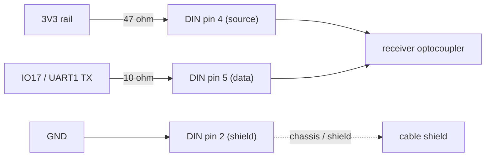

# Hardware

The bridge is built on a **Waveshare ESP32-S3-ETH** — a single board with the
Ethernet PHY already integrated, so no separate module is needed.

- **MCU:** ESP32-S3R8 (dual-core LX7 @ 240 MHz, 8 MB octal PSRAM)
- **Flash:** 16 MB (W25Q128)
- **Ethernet:** onboard **W5500** over SPI (its own crystal — no EMAC/Wi-Fi PLL
  clock issues)
- **USB-C:** native USB, used for power, flashing, and serial. Wired as a
  **device** port (5.1 kΩ CC pulldowns), routed to the ESP32 native USB pins
  (IO19/IO20) through 30 Ω series resistors.
- **Headers:** Pico-style 2x20 (H1, H2) expose the usable GPIO.

Board wiki and schematic:
- <https://www.waveshare.com/wiki/ESP32-S3-ETH>
- <https://files.waveshare.com/wiki/ESP32-S3-ETH/ESP32-S3-ETH-Schematic.pdf>

## USB role: the board is the host

The ESP32 is the **USB host**; a class-compliant USB MIDI device (drum machine,
groovebox, synth) plugs into a **USB-A receptacle** as a peripheral.

The onboard USB-C is hardwired as a device port and cannot be made a host
without reworking SMD resistors. A USB-A receptacle has no CC pins, so the
connector type itself fixes the ESP32 as host — adding a USB-A jack and
selecting host mode in firmware is the clean, no-rework path. Host mode also
makes the box a self-powered standalone unit: it runs on its own power, listens
to Pro DJ Link independently, and can host any class-compliant USB MIDI device.

> USB host/device is not the same as MIDI direction. Clock always flows box to
> peripheral; the box being host just means it powers and enumerates the bus.

## Pin map

Board silkscreen uses Espressif "IO" naming (`IO15` == `GPIO15`). Firmware uses
the bare number.

**Reserved by the board (do not use):**

| Function | Pins |
|---|---|
| W5500 Ethernet (fixed) | IO9 = RST, IO10 = INT, IO11 = MOSI, IO12 = MISO, IO13 = SCLK, IO14 = CS |
| Native USB | IO19 = D-, IO20 = D+ (shared with USB-C via 30 Ω) |
| Avoid | IO33-IO37 (octal PSRAM), strapping pins IO0/IO3/IO45/IO46 |

**Peripheral assignments (all verified free, non-strapping):**

| Peripheral | Signal | Pin | Header | Notes |
|---|---|---|---|---|
| USB-A host jack | D+ | IO20 | H2 | native USB |
| | D- | IO19 | H2 | native USB |
| | VBUS (5 V out) | `VBUS` | H1 | board 5 V rail; powers the peripheral |
| | GND | `GND` | either | |
| DIN-5 MIDI out | UART1 TX | IO17 | H1 | see wiring below |
| SSD1306 OLED (I2C) | SDA | IO15 | H1 | hardware I2C |
| | SCL | IO16 | H1 | |
| | VCC | `3V3` | H1 | 3.3 V, not 5 V |
| EC11 rotary encoder | A | IO18 | H1 | INPUT_PULLUP |
| | B | IO2 | H1 | INPUT_PULLUP |
| | push (SW) | IO1 | H1 | INPUT_PULLUP |
| Button: nudge - | in | IO40 | H2 | INPUT_PULLUP, other side to GND |
| Button: nudge + | in | IO39 | H2 | INPUT_PULLUP, other side to GND |
| Button: tap / re-sync / back | in | IO38 | H2 | INPUT_PULLUP, other side to GND |

Power pins (all on H1): `VBUS` = 5 V from USB-C, `VSYS` = regulator input (do
not use for peripherals), `3V3` = regulated 3.3 V (logic + OLED), `GND`. The
board has no pin literally labeled "5V" — `VBUS` is the 5 V.

The WS2812 RGB status LED is onboard; this board routes its data line through
alternate 0 Ω jumpers to either GP4 or GP21 depending on how the unit shipped.
Firmware drives both to be population-agnostic.

## Wiring: DIN-5 MIDI out

MIDI is a current loop: the sender's TX pin sinks current that flows out of DIN
pin 4, through the receiver's optocoupler, and back into DIN pin 5. Because the
ESP32 GPIO is 3.3 V, use the **3.3 V MIDI spec resistor values** (the older
2x220 Ω values are the 5 V spec and deliver only ~2 mA at 3.3 V — marginal).

| From | Resistor | To |
|---|---|---|
| 3V3 | 47 Ohm (spec 33; 22-47 works) | DIN pin 4 (current source) |
| IO17 (UART1 TX) | 10 Ohm | DIN pin 5 (data) |
| GND | none | DIN pin 2 (shield) |

- DIN pins 1 and 3 are unused. Leave them empty.
- If the jack has a metal shield/chassis lug, jumper it to pin 2 locally.
- UART is 31250 baud, 8N1. TX idles high (MIDI "no current" / logical 1).

> **Wiring trap — pin 4/5 mirror flip.** DIN 180-degree pin numbering is
> non-sequential, and it is easy to mirror the pinout when reading it from the
> solder side. A reversed data/power pair **silently kills MIDI**: the loop
> still passes DC current (so every voltmeter check looks fine and a slow GPIO
> toggle still swings the pin), but the optocoupler is reverse-biased and the
> signal never decodes. Fingerprint: DC current flows, resistors are correct,
> the pin toggles, yet a known-good receiver decodes nothing. Fix: swap the
> data and power wires at the jack.

## Wiring: USB-A host jack

USB-A receptacle pinout: 1 = VBUS, 2 = D-, 3 = D+, 4 = GND.

| Receptacle pin | To |
|---|---|
| 1 (VBUS) | board `VBUS` (H1) |
| 2 (D-) | IO19 (H2) |
| 3 (D+) | IO20 (H2) |
| 4 (GND) | `GND` |

## Hardware gotchas

- **Power rule.** With a USB device in the USB-A jack, power the board from a
  **charger/wall, not a computer** — a computer on USB-C is a second host on
  the shared IO19/IO20 lines and they conflict. A plain charger only drives
  VBUS and is fine. The charger must actually deliver adequate current; some
  laptop/USB-PD chargers would not reliably start a peripheral.
- **OLED: hardware I2C only.** Software I2C toggles pin direction per bit; the
  IDF GPIO driver logs each change, and a full frame backs up the console until
  the UI task trips the task watchdog. Use the U8g2 hardware-I2C constructor
  with explicit pins.
- **USB host enumeration buffer.** IDF's hub driver aborts enumeration if a
  device's configuration descriptor exceeds
  `CONFIG_USB_HOST_CONTROL_TRANSFER_MAX_SIZE` (default 256). USB-MIDI synths
  exceed that and silently fail to enumerate while a USB mouse works. It is
  bumped to 2048 in `firmware/sdkconfig.defaults`.

## RGB LED status legend (production build)

Production/host mode has no serial console (USB-Serial-JTAG and USB-OTG share
the one USB PHY), so the onboard RGB LED is the primary diagnostic:

| Color | Meaning |
|---|---|
| yellow (brief) | booted |
| dim blue | host driver up, no device enumerated |
| red | a device enumerated but exposed no MIDI interface |
| magenta | USB host driver failed to install |
| green (flashes on the beat) | working — enumerated and clocking |

For network/clock debugging, flash the `diag` build (USB host skipped, so the
USB-C serial console stays alive).
